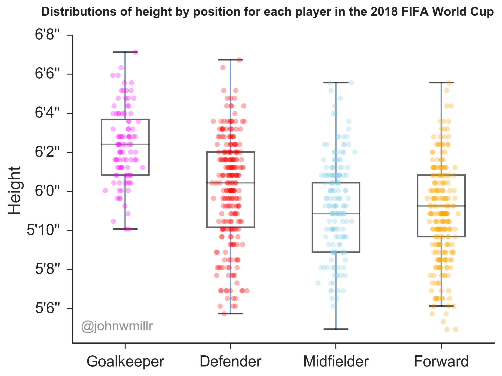

# FIFA World Cup 2018
We're in the midst of the 2018 FIFA World Cup. I've wanted to play with some sort of sports-related data for a while, so I figured now is as good as a time as any to start. I've included a brief overview here, but you can take a look at [my blog post](https://www.johnwmillr.com/fifa-world-cup-data/) for more details.

## Collecting the data
After doing some Googling for World Cup APIs, I came across the [Sportradar API](https://developer.sportradar.com/io-docs). Sportradar provides 15 APIs for soccer data alone. Luckily, they provide a [free trial](https://developer.sportradar.com/member/register) for the APIs that allows a total of 1,000 queries. I wrote a [Python package](https://github.com/johnwmillr/SportradarAPIs) to make it easy to download data from a number of the Sportradar APIs.

## Visualizations
I was interested in the relationships between height and weight and player positions after seeing this [great post](https://www.reddit.com/r/dataisbeautiful/comments/1oh47i/height_and_weight_of_all_active_nfl_players_by/) looking for similar patterns in the NFL.

